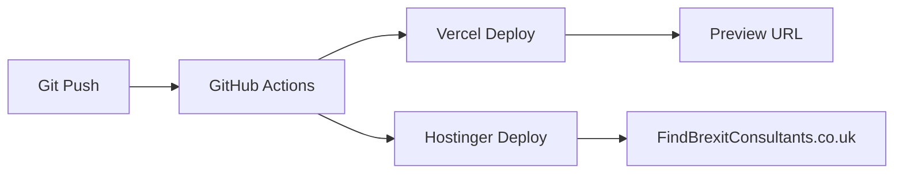

# 🚀 GitHub Actions Setup - Step by Step

Your FindBrexitConsultants.co.uk project is ready for GitHub Actions deployment! Here's exactly what you need to do:

## 📤 Step 1: Push Code to GitHub

Your code is committed and ready. Run these commands in your terminal:

```bash
cd /workspace/findbrexit-consultants
git push -u origin master
```

**If you get authentication errors:**
- Option A: Use GitHub CLI: `gh auth login`
- Option B: Create a [Personal Access Token](https://github.com/settings/tokens)
- Option C: Set up [SSH keys](https://docs.github.com/en/authentication/connecting-to-github-with-ssh)

## 🔐 Step 2: Configure GitHub Secrets

1. **Go to your repository secrets page:**
   👉 https://github.com/mitchell1972/findbrexitconsultants/settings/secrets/actions

2. **Click "New repository secret" for each of these:**

### For Vercel Deployment:
| Secret Name | How to Get It |
|-------------|---------------|
| `VERCEL_TOKEN` | [Vercel Account Tokens](https://vercel.com/account/tokens) → Create new token |
| `VERCEL_ORG_ID` | Run `vercel link` locally → Check `.vercel/project.json` |
| `VERCEL_PROJECT_ID` | Run `vercel link` locally → Check `.vercel/project.json` |

### For Hostinger Deployment:
| Secret Name | How to Get It |
|-------------|---------------|
| `HOSTINGER_FTP_HOST` | Hostinger Control Panel → FTP Access (e.g., `ftp.yourdomain.com`) |
| `HOSTINGER_FTP_USERNAME` | Hostinger Control Panel → FTP Access |
| `HOSTINGER_FTP_PASSWORD` | Hostinger Control Panel → FTP Access |
| `VITE_SUPABASE_URL` | `https://zjfilhbczaquokqlcoej.supabase.co` |
| `VITE_SUPABASE_ANON_KEY` | `eyJhbGciOiJIUzI1NiIsInR5cCI6IkpXVCJ9...` |

## 🔧 Step 3: Getting Vercel Credentials

### 3.1 Get VERCEL_TOKEN:
1. Go to https://vercel.com/account/tokens
2. Click "Create Token"
3. Give it a name like "GitHub Actions"
4. Copy the token (starts with `vt_...`)

### 3.2 Get VERCEL_ORG_ID & VERCEL_PROJECT_ID:
1. Install Vercel CLI: `npm install -g vercel`
2. In your project: `vercel link`
3. Follow prompts to link your project
4. Check `.vercel/project.json` file:
```json
{
  "projectId": "prj_xxx...",  // This is VERCEL_PROJECT_ID
  "orgId": "team_xxx..."     // This is VERCEL_ORG_ID
}
```

## 🌐 Step 4: Getting Hostinger FTP Credentials

1. **Login to Hostinger Control Panel**
2. **Navigate to "File Manager" or "FTP Access"**
3. **Get/Create FTP Account:**
   - **Host**: Usually `ftp.yourdomain.com` or `ftp.hostinger.com`
   - **Username**: Your FTP username (often your main account)
   - **Password**: Create or get your FTP password
   - **Port**: 21 (standard FTP)

*Screenshot reference: Look for "FTP Accounts" or "File Manager" in your Hostinger dashboard*

## ✅ Step 5: Test Your Setup

1. **Push your code:**
```bash
git add .
git commit -m "Test GitHub Actions deployment"
git push
```

2. **Check deployment status:**
   - Go to GitHub → Actions tab
   - You should see 2 workflows running:
     - ✅ "Vercel Production Deployment"  
     - ✅ "Hostinger Production Deployment"

3. **Verify live sites:**
   - **Hostinger**: https://FindBrexitConsultants.co.uk
   - **Vercel**: Check deployment URL in Actions log

## 🔍 Troubleshooting

### If Vercel deployment fails:
- Check VERCEL_TOKEN is valid
- Ensure VERCEL_ORG_ID and VERCEL_PROJECT_ID are correct
- Verify you have access to the Vercel project

### If Hostinger deployment fails:
- Test FTP credentials with an FTP client first
- Check FTP hostname is correct (might need IP address)
- Ensure FTP account has write access to public_html

### Common Issues:
- **Wrong FTP path**: Try `./` instead of `./public_html/`
- **FTP timeout**: Contact Hostinger support for server details
- **Secrets not found**: Ensure secret names match exactly (case-sensitive)

## 📊 What Happens Next

After successful setup:



Every push to main/master will:
1. ✅ Build optimized production version
2. ✅ Deploy to Vercel (staging/preview)
3. ✅ Deploy to Hostinger (production)
4. ✅ Send you notifications on success/failure

## 🎉 You're All Set!

Your FindBrexitConsultants.co.uk now has enterprise-level CI/CD with dual hosting redundancy!

**Need Help?** Check these files:
- `GITHUB_DEPLOYMENT_README.md` - Vercel details
- `HOSTINGER_GITHUB_ACTIONS_SETUP.md` - Hostinger details
- `DUAL_DEPLOYMENT_GUIDE.md` - Overview of both systems
