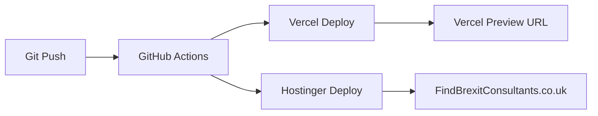

# Dual Deployment Setup: Vercel + Hostinger

Your FindBrexitConsultants.co.uk project now supports **automatic deployment to both Vercel and Hostinger** via GitHub Actions.

## 🚀 Deployment Options

### Option 1: Vercel (Recommended for Development)
- **Fast global CDN**
- **Automatic preview deployments** for branches
- **Easy rollbacks and monitoring**
- **Perfect for testing and staging**

### Option 2: Hostinger (Production)
- **Your primary hosting provider**
- **Direct control over hosting**
- **Custom domain: FindBrexitConsultants.co.uk**
- **Traditional shared hosting**

## ⚡ Automatic Dual Deployment

Every push to `main`/`master` branch triggers **both deployments simultaneously**:

## 🔧 Setup Requirements

### For Vercel Deployment:
1. `VERCEL_TOKEN` - Your Vercel auth token
2. `VERCEL_ORG_ID` - Your Vercel organization ID  
3. `VERCEL_PROJECT_ID` - Your Vercel project ID

### For Hostinger Deployment:
1. `HOSTINGER_FTP_HOST` - Your FTP server hostname
2. `HOSTINGER_FTP_USERNAME` - Your FTP username
3. `HOSTINGER_FTP_PASSWORD` - Your FTP password
4. `VITE_SUPABASE_URL` - Your Supabase project URL
5. `VITE_SUPABASE_ANON_KEY` - Your Supabase anonymous key

## 📁 GitHub Actions Workflows

### `.github/workflows/vercel-deploy.yml`
- Deploys to Vercel hosting
- Creates preview URLs for testing
- Fast global distribution

### `.github/workflows/hostinger-deploy.yml`
- Builds production-optimized version
- Uploads directly to Hostinger via FTP
- Updates live FindBrexitConsultants.co.uk site

## 🎯 Domain Configuration

The application is configured for:
- **Primary Domain**: `FindBrexitConsultants.co.uk`
- **Email Addresses**: `info@FindBrexitConsultants.co.uk`
- **Privacy Contact**: `privacy@FindBrexitConsultants.co.uk`

## 📋 Next Steps

1. **Push to GitHub**: `git push -u origin main`
2. **Configure GitHub Secrets** (see setup guides)
3. **Both sites deploy automatically!**

## 📚 Documentation

- **Vercel Setup**: `GITHUB_DEPLOYMENT_README.md`
- **Hostinger Setup**: `HOSTINGER_GITHUB_ACTIONS_SETUP.md`
- **Hostinger Manual Deployment**: `HOSTINGER_DEPLOYMENT.md`

## ✅ Benefits of Dual Deployment

- **Redundancy**: Multiple hosting options
- **Performance**: Choose best option for different needs  
- **Testing**: Use Vercel for staging, Hostinger for production
- **Flexibility**: Easy switching between providers

Your FindBrexitConsultants.co.uk application is now ready for production with enterprise-level deployment automation! 🎉
